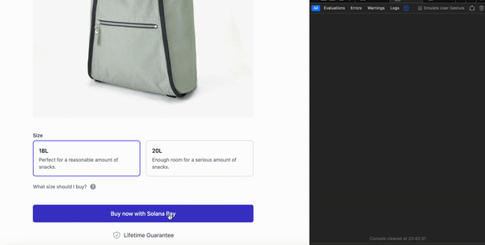
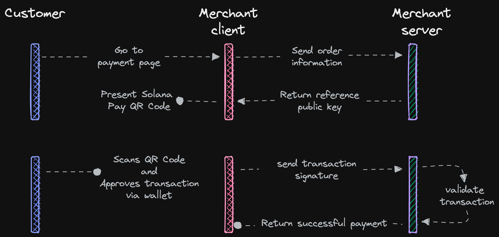

# checkout-api

Payment API server based on the [Solana blockchain](https://solana.com).

### Demo

[Checkout page](https://example-checkout.easypmnt.com) is connected to the mainnet node and demonstrates purchasing via QR code, accruing and applying bonuses, and automatic token swapping if needed.

## Features

- [x] Supports two payment flows: `classic` (via solana wallet adapter button) and `QR code`.
- [x] Webhooks for transaction status updates on the client's server.
- [x] Transaction status updates via websocket (useful for client-side widgets).
- [x] Ability to use as a standalone API server or as a library.
- [x] Oauth2 authorization for client.
- [x] Support for authomated token swaps, if a customer pays with a token that the merchant does not support (using [Jupiter](https://jup.ag)).
- [x] A loyalty program for customers to earn bonuses for purchases and redeem them for discounts.

### Comming soon

- [ ] Project documentation, in addition to the default on [pkg.go.dev](https://pkg.go.dev/github.com/easypmnt/checkout-api)
- [ ] Split payments between multiple merchants.
- [ ] Typescript/Javascript SDK and widget for quick integration into a project.
- [ ] Plugins for popular CMS (e.g., WordPress, PrestaShop, etc).
- [ ] Web UI to configure payment server options.
- [ ] More options for the loyalty program: bonus cards with different discount levels or additional benefits, bonus for N purchases, etc.

## How it works

According to the [Solanapay protocol](https://docs.solanapay.com/core/transfer-request/merchant-integration).
